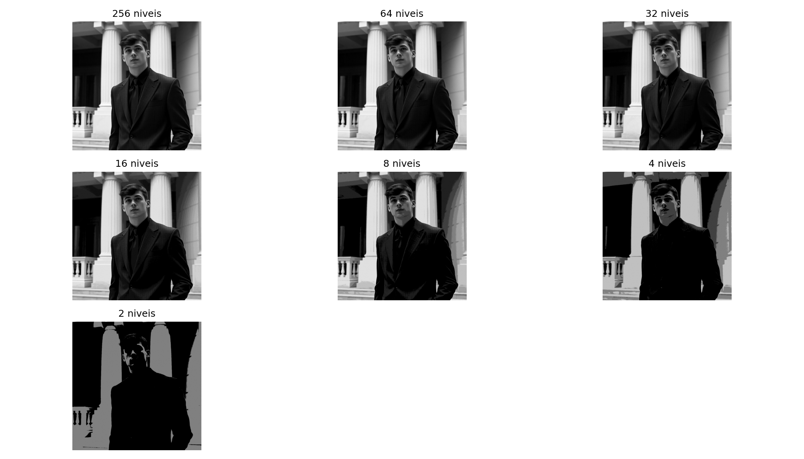
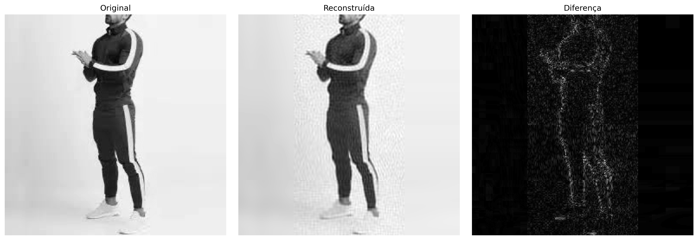
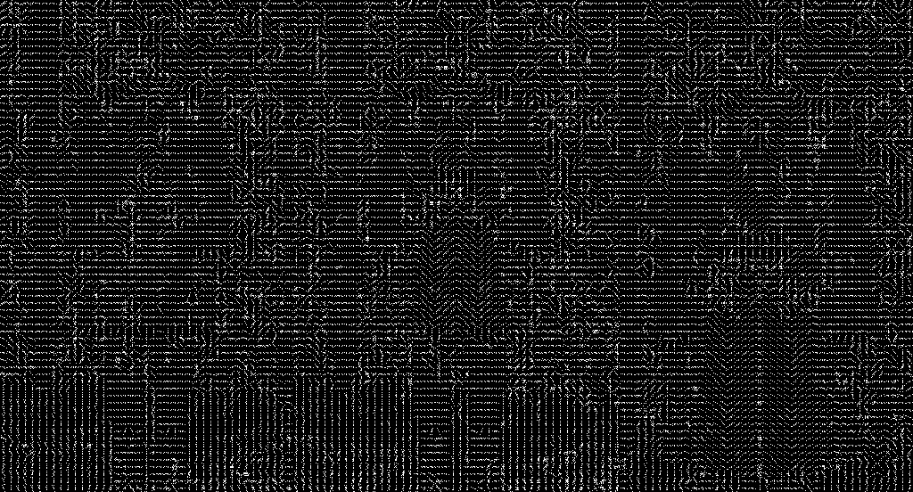

# Processamento de Imagens

Implementações acadêmicas de técnicas fundamentais de processamento digital de imagens, desenvolvidas para a disciplina de Processamento de Imagens da Universidade Estadual do Ceará (UECE). Os experimentos usam imagens ligadas à moda e ao vestuário e priorizam a implementação manual dos algoritmos para tornar cada etapa observável.

**Aluno:** Samuel William Silva Almeida  
**Tema das imagens:** roupas, acessórios, modelos e produtos de moda

## Visão geral

| Atividade | Conteúdo principal | Implementação | Resultados |
|---|---|---|---|
| [Atividade 1](atividade1/) | Esboço, correção gama, fusão, transformações de intensidade, mosaico e quantização | Jupyter Notebook, NumPy e OpenCV | `atividade1/saidas_questao*/` |
| [Atividade 2](atividade2/) | Convolução espacial, FFT, filtros frequenciais e compressão espectral | Scripts CLI, NumPy, Pillow e Matplotlib | `atividade2/saidas/` |
| [Atividade 3](atividade3/) | Compressão por DCT e descritores de imagem | Scripts, NumPy, OpenCV e Matplotlib | `atividade3/resultados/` |
| [Atividade 4](atividade4/) | Morfologia, gradientes, HOG e watershed | Scripts, NumPy e OpenCV | `atividade4/imagens/saidas_questao*/` |

Os algoritmos centrais foram escritos manualmente, sem funções prontas como `cv2.filter2D`, `cv2.GaussianBlur`, `cv2.dct` ou `cv2.morphologyEx`. As imagens são processadas em `uint8`, com valores limitados ao intervalo `[0, 255]`. Quando uma imagem BGR precisa ser convertida para cinza, utiliza-se a luminância

```text
Y = 0,114 B + 0,587 G + 0,299 R
```

Há duas exceções legadas que não fazem parte do algoritmo estudado: um notebook usa `cv2.cvtColor` apenas para exibir BGR como RGB no Matplotlib, e a Atividade 3 usa `cv2.absdiff` somente para gerar a imagem diagnóstica de diferença. A DCT, os filtros, os descritores, a morfologia e o watershed continuam implementados no código do projeto.

## Resultados em destaque

### Quantização de níveis de cinza



### Compressão baseada em DCT



### Gradientes orientados (HOG)



## Estrutura do repositório

```text
.
├── atividade1/                  # seis questões em notebooks
│   ├── atividade1.ipynb         # execução consolidada
│   ├── reports/                 # relatório em Markdown
│   └── saidas_questao1..6/      # imagens e métricas JSON
├── atividade2/                  # filtros espaciais e frequenciais
│   ├── q1.py                    # onze filtros por convolução
│   ├── q2.py                    # experimento complementar de gama
│   ├── questao2.py              # FFT, filtros e compressão
│   └── saidas/
├── atividade3/
│   ├── scripts/q1.py            # DCT/IDCT e quantização
│   ├── scripts/q2.py            # cinco descritores
│   ├── images/
│   └── resultados/
├── atividade4/
│   ├── questao1.py              # morfologia matemática
│   ├── questao2.py              # Gaussiano, Sobel e HOG
│   ├── questao3.py              # watershed em pilha de roupas
│   ├── questao3_chapeus.py      # watershed em chapéus
│   └── imagens/
├── engine/                      # scripts independentes de estudo
└── requirements.txt            # dependências de todo o projeto
```

`engine/` reúne práticas avulsas e não é importado pelas quatro atividades. O arquivo `atividade4/questao3 copy.py` é uma cópia legada e não é necessário para reproduzir os resultados.

## Preparação do ambiente

### Pré-requisitos

- Python 3.10 ou superior;
- `pip` e o módulo `venv`;
- aproximadamente 200 MB livres para o repositório, ambiente e novas saídas;
- interface Jupyter para a Atividade 1.

Os scripts fazem muitas iterações em Python puro. A execução da convolução 21 × 21 da Atividade 1 e das rotinas da Atividade 4 pode demorar, especialmente com as imagens originais de alta resolução.

### Linux e macOS

Execute a partir da raiz clonada do projeto:

```bash
git clone <URL_DO_REPOSITORIO> Processamento_imagens
cd Processamento_imagens

python3 -m venv .venv
source .venv/bin/activate
python -m pip install --upgrade pip
python -m pip install -r requirements.txt
```

### Windows (PowerShell)

```powershell
git clone <URL_DO_REPOSITORIO> Processamento_imagens
Set-Location Processamento_imagens

py -m venv .venv
.\.venv\Scripts\Activate.ps1
python -m pip install --upgrade pip
python -m pip install -r requirements.txt
```

O [requirements.txt](requirements.txt) da raiz foi obtido pela varredura dos imports dos 27 scripts Python e dos seis notebooks do repositório. Ele instala a união necessária para executar as quatro atividades, os scripts de `engine/` e os geradores de relatórios:

- `numpy`, `Pillow`, `matplotlib` e `opencv-python`: processamento, leitura, gravação e visualização de imagens;
- `jupyterlab` e `nbconvert`: execução interativa e exportação dos notebooks;
- `fpdf2`: relatórios das Atividades 3 e 4;
- `Markdown` e `WeasyPrint`: conversão do relatório da Atividade 2 para HTML e PDF.

O arquivo [atividade2/requirements.txt](atividade2/requirements.txt) foi preservado como instalação mínima e local daquela atividade. Para reproduzir o projeto inteiro, use sempre o arquivo da raiz.

O WeasyPrint pode exigir bibliotecas nativas adicionais conforme o sistema operacional. Isso não afeta a execução dos algoritmos nem a geração das imagens.

### Verificação rápida

```bash
python -c "import cv2, numpy, matplotlib, PIL, fpdf, markdown, weasyprint; print('Ambiente pronto')"
```

Em servidor sem interface gráfica, use um backend não interativo antes de executar os scripts com Matplotlib:

```bash
export MPLBACKEND=Agg
```

## Como reproduzir os resultados

Os comandos abaixo partem da raiz do projeto. Os scripts substituem arquivos de mesmo nome nas pastas de saída.

### Atividade 1 — operações básicas

O notebook consolidado [atividade1/atividade1.ipynb](atividade1/atividade1.ipynb) reúne as seis questões. Antes de executá-lo em outro computador, altere a primeira célula, pois o arquivo foi salvo com um caminho absoluto da máquina original:

```python
ROOT = Path.cwd()
```

Em seguida, inicie o Jupyter dentro da pasta da atividade e execute todas as células:

```bash
cd atividade1
jupyter lab
```

Também é possível executar uma cópia completa pela linha de comando, após corrigir `ROOT`:

```bash
jupyter nbconvert \
  --to notebook \
  --execute atividade1.ipynb \
  --output atividade1_executado.ipynb \
  --ExecutePreprocessor.timeout=-1
```

Os notebooks separados `questao_1_esboco_lapis.ipynb` e `questao2.ipynb` usam caminhos relativos e devem ser abertos a partir de `atividade1/`. O notebook `questao3_media_ponderada.ipynb` também contém um caminho absoluto antigo; para reproduzir as saídas versionadas, prefira o notebook consolidado, que usa `bermuda2.png` e `blusa2.png`.

Depois da execução, retorne à raiz com `cd ..` antes de usar os comandos das próximas atividades.

#### Questão 1 — efeito de esboço a lápis

O pipeline converte a fotografia para luminância, cria um kernel gaussiano 21 × 21, aplica a convolução manual com bordas replicadas e usa divisão *color dodge* para destacar contornos. As áreas uniformes são suavizadas e as transições de intensidade da roupa, do rosto e dos acessórios ficam mais evidentes no esboço.

Saídas: [cinza](atividade1/saidas_questao1/resultado_cinza.jpg), [desfoque](atividade1/saidas_questao1/resultado_desfocada.jpg) e [esboço](atividade1/saidas_questao1/resultado_esboco.jpg).

#### Questão 2 — correção gama

A transformação implementada é `B = A^(1/γ)`, após normalização para `[0, 1]`. Com essa fórmula, `γ < 1` escurece a imagem, `γ = 1` a preserva e `γ > 1` a clareia. Isso é confirmado pelas médias das saídas atuais: 39,80 (`γ=0,25`), 75,65 (`γ=0,5`), 123,85 (`γ=1`), 151,72 (`γ=1,5`), 170,01 (`γ=2`) e 192,02 (`γ=3`).

Saída comparativa: [comparativo_gama.png](atividade1/saidas_questao2/comparativo_gama.png).

#### Questão 3 — média ponderada

Duas imagens em cinza e de mesmo tamanho são combinadas com pesos `(0,2; 0,8)`, `(0,5; 0,5)` e `(0,8; 0,2)`. A imagem com maior peso domina a composição, enquanto a combinação igual produz a transição mais equilibrada. As médias registradas foram 127,12, 125,58 e 124,03; o desvio padrão mínimo do caso 50/50 (50,09) indica uma mistura ligeiramente mais uniforme.

Saídas e parâmetros: [saidas_questao3](atividade1/saidas_questao3/) e [resultado_metricas_execucao.json](atividade1/saidas_questao3/resultado_metricas_execucao.json).

#### Questão 4 — transformações de intensidade e geometria

São produzidos o negativo, o remapeamento para `[100, 200]`, a inversão horizontal das linhas pares, o espelhamento da metade superior sobre a inferior e o espelhamento vertical completo. O remapeamento reduz o desvio padrão de 59,49 para 23,33 porque comprime a faixa tonal. As inversões preservam histograma, média e dispersão, pois apenas mudam a posição dos pixels; o espelhamento da metade superior altera essas estatísticas ao substituir a metade inferior.

Saídas: [saidas_questao4](atividade1/saidas_questao4/).

#### Questão 5 — mosaico 4 × 4

A imagem é recortada para dimensões múltiplas de quatro, dividida em 16 blocos de 256 × 256 e reorganizada na ordem:

```text
 6  11  13   3
 8  16   1   9
12  14   2   7
 4  15  10   5
```

O mosaico mantém média (90,36), desvio padrão (83,65) e histograma do recorte original, pois apenas permuta os blocos.

Saída comparativa: [03_q5_comparativo.png](atividade1/saidas_questao5/03_q5_comparativo.png).

#### Questão 6 — quantização

A imagem é representada com 256, 64, 32, 16, 8, 4 e 2 níveis. Entre 256 e 16 níveis, os detalhes principais permanecem reconhecíveis. Em 8 níveis surge posterização clara; com 4 e 2 níveis, sombras e texturas do traje se fundem em grandes regiões. A quantização usa o limite inferior de cada faixa, por isso a média cai de 90,36 (256 níveis) para 42,43 (2 níveis).

Saídas e métricas: [saidas_questao6](atividade1/saidas_questao6/) e [resultado_metricas_execucao.json](atividade1/saidas_questao6/resultado_metricas_execucao.json).

### Atividade 2 — domínios espacial e da frequência

#### Questão 1 — onze filtros espaciais

Execute `q1.py` com a pasta de saída explícita. Isso evita o valor padrão legado do script, que aponta para `saidas_questao2`:

```bash
python atividade2/q1.py \
  --input atividade2/imageq1.png \
  --outdir atividade2/saidas/saidas_questao1
```

São aplicados manualmente:

| Filtro | Operação | Efeito observado |
|---|---|---|
| `h1` | média 3 × 3 | suavização leve |
| `h2` | Gaussiano 5 × 5 | suavização ponderada e menos abrupta |
| `h3`, `h4` | Sobel X/Y | bordas verticais e horizontais |
| `h5`, `h6` | Prewitt X/Y | gradientes direcionais com pesos uniformes |
| `h7` | Laplaciano | bordas em várias direções |
| `h8` | *sharpen* | realce de detalhes |
| `h9` | relevo | efeito direcional de profundidade |
| `h10` | média 5 × 5 | suavização mais forte que `h1` |
| `h11` | *unsharp mask* | nitidez com preservação do nível médio |

Os filtros derivativos (`h3` a `h7`) apresentam média próxima de zero antes da normalização, como esperado de kernels que respondem a variações e não à intensidade constante. As saídas visuais são reescaladas individualmente para `[0, 255]`; por isso, o brilho aparente entre filtros não deve ser interpretado como resposta absoluta comparável.

O script gera `q1_h1.png` a `q1_h11.png` e [resultados_q1.json](atividade2/saidas/saidas_questao1/resultados_q1.json), que registra kernels e estatísticas.

#### Experimento complementar — correção gama

```bash
python atividade2/q2.py \
  --input atividade2/image2.png \
  --outdir atividade2/saidas/saidas_questao2 \
  --gammas 0.25,0.5,1.0,1.5,2.0,3.0
```

Esse script repete a transformação `A^(1/γ)` da Atividade 1 e salva imagens PNG, comparação e métricas JSON.

#### Questão 2 — FFT, filtros e compressão

```bash
python atividade2/questao2.py \
  --input atividade2/image2.png \
  --outdir atividade2/saidas/saidas_questao2 \
  --low-high-radii 15,30,60 \
  --band-pairs 10-30,20-50 \
  --compress-thresholds 70,85,95
```

O processamento realiza FFT 2D, centraliza a frequência zero, constrói máscaras circulares e reconstrói a imagem por IFFT:

- passa-baixa: retém baixas frequências e suaviza; raios maiores preservam mais detalhes;
- passa-alta: remove o conteúdo de baixa frequência e destaca transições e bordas;
- passa-faixa: isola estruturas de uma escala intermediária;
- rejeita-faixa: remove essa escala e preserva o restante do espectro.

Na compressão, os percentis 70, 85 e 95 zeraram respectivamente 400.691 (70%), 486.553 (85%) e 543.795 (95%) dos 572.416 coeficientes. Restaram aproximadamente 30%, 15% e 5% dos coeficientes. Quanto maior o percentil, maior a perda de detalhes e a alteração do histograma. Esta é uma simulação de esparsificação espectral: como o programa ainda salva uma imagem PNG reconstruída, esses percentuais não representam diretamente a redução do tamanho do arquivo em disco.

Saídas: [espectro](atividade2/saidas/saidas_questao2/00_fft/), [máscaras](atividade2/saidas/saidas_questao2/01_masks/), [imagens filtradas](atividade2/saidas/saidas_questao2/02_filtradas/), [compressões](atividade2/saidas/saidas_questao2/03_compressao/), [histogramas](atividade2/saidas/saidas_questao2/04_histogramas/) e [resultados_questao2.json](atividade2/saidas/saidas_questao2/resultados_questao2.json).

### Atividade 3 — compressão e descrição

Os caminhos são resolvidos em relação aos próprios scripts; portanto, eles podem ser chamados da raiz do projeto.

#### Questão 1 — DCT/IDCT manual

```bash
python atividade3/scripts/q1.py
```

O script converte `runner.png` para cinza, recorta as dimensões para múltiplos de `BLOCK_SIZE`, aplica DCT-II bidimensional, quantiza os coeficientes e reconstrói cada bloco com a IDCT. Os parâmetros atuais são blocos 64 × 64 e fator de qualidade 2,0. Para blocos múltiplos de oito, a matriz JPEG 8 × 8 é expandida com `np.kron`.

Na saída versionada, a reconstrução preserva a forma e o contraste global, mas a diferença evidencia ruído de quantização no corpo do modelo e descontinuidades entre blocos. Comparada ao original em cinza, a reconstrução apresenta MSE 30,58, erro absoluto médio 3,09 e PSNR 33,28 dB. Esses valores indicam fidelidade global razoável, embora os artefatos sejam visíveis em regiões texturizadas e nas fronteiras dos blocos.

Resultados: [q3_64x64](atividade3/resultados/q3_64x64/).

#### Questão 2 — descritores em tons de cinza

```bash
python atividade3/scripts/q2.py
```

O script compara `blusa2.png` e `jacket2.png` por cinco descritores manuais:

| Descritor | `blusa2.png` | `jacket2.png` | Interpretação |
|---|---:|---:|---|
| Média | 128,18 | 202,41 | a segunda imagem é globalmente mais clara |
| Variância | 3.266,91 | 6.905,87 | a segunda tem maior contraste global |
| Energia | 0,0085 | 0,4100 | a segunda concentra pixels em poucos níveis |
| Diferença horizontal | 5,58 | 3,79 | a primeira varia mais entre vizinhos horizontais |
| Diferença vertical | 8,23 | 2,20 | a primeira tem mais estrutura/textura vertical local |

A combinação dos descritores separa brilho e contraste globais de textura local. A alta variância de `jacket2.png` junto às baixas diferenças entre vizinhos sugere grandes regiões internamente homogêneas, mas com níveis muito distintos entre objeto e fundo. Esse vetor simples pode alimentar classificadores de textura ou servir para busca por imagens semelhantes.

Resultados: [q4](atividade3/resultados/q4/) e [descritores.txt](atividade3/resultados/q4/descritores.txt).

Para reconstruir o relatório após gerar as imagens:

```bash
python atividade3/gerar_relatorio.py
```

### Atividade 4 — morfologia, bordas e segmentação

#### Questão 1 — operações morfológicas

```bash
python atividade4/questao1.py
```

As imagens de terno e vestido são convertidas para cinza, binarizadas com limiar 127 e processadas com elementos estruturantes quadrados 3 × 3, 5 × 5 e 15 × 15. Erosão e dilatação são as primitivas; abertura é erosão seguida de dilatação, e fechamento é dilatação seguida de erosão.

Os resultados confirmam o efeito crescente do elemento estruturante. No terno, a erosão reduz a área branca de 15,86% para 12,66%, 11,14% e 4,95%; a dilatação aumenta para 20,64%, 26,13% e 57,28%. No vestido, a erosão chega a 7,12% e a dilatação a 44,45% com 15 × 15. Abertura remove componentes finos e ruído claro; fechamento preenche falhas e conecta regiões próximas. O kernel 15 × 15 já elimina ou funde detalhes relevantes, sendo adequado apenas quando essas estruturas menores são indesejadas.

Resultados: [saidas_questao1](atividade4/imagens/saidas_questao1/).

#### Questão 2 — Gaussiano, Sobel e HOG simplificado

```bash
python atividade4/questao2.py
```

O pipeline aplica um Gaussiano manual 5 × 5 (`σ=1,4`), calcula Sobel X/Y, magnitude e orientação e divide a região válida em células 8 × 8 com nove bins entre 0° e 180°. Para a imagem atual, são produzidas 69 × 128 células e exatamente 79.488 características.

A magnitude destaca silhueta, contornos das roupas e transições do cenário; o HOG transforma essas respostas em uma distribuição espacial de direções. A implementação é intencionalmente simplificada: não há normalização por blocos nem interpolação entre bins, então o descritor é mais sensível a contraste e iluminação que o HOG usado em bibliotecas de visão computacional.

Resultados: [saidas_questao2](atividade4/imagens/saidas_questao2/) e [descritor textual](atividade4/imagens/saidas_questao2/2_modelo_hog_descriptor.txt).

#### Questão 3 — watershed baseado em marcadores

Para a pilha de roupas:

```bash
python atividade4/questao3.py
```

Para repetir o experimento com chapéus usado no relatório:

```bash
python atividade4/questao3_chapeus.py
```

O pipeline usa limiar 127, fechamento 5 × 5, transformada de distância Chamfer 3-4-5, máximos locais acima de 85% da distância máxima e inundação por fila de prioridade. A paleta dos segmentos é determinística (`seed=42`). As saídas atuais contêm 22 marcadores para a pilha de roupas e 62 para os chapéus.

O resultado demonstra todas as etapas do watershed, mas também sua principal limitação: cada pixel marcado é tratado como uma região independente e os marcadores de maior distância nem sempre coincidem com o centro de cada objeto. Na imagem de chapéus, várias fronteiras aparecem como faixas nas bordas da imagem, enquanto parte dos objetos fica sem separação útil. Portanto, os números 22 e 62 representam marcadores/segmentos gerados, não uma contagem confiável de peças. Marcadores por componentes conexos, tratamento explícito do fundo e ajuste do limiar seriam necessários para uma segmentação mais robusta.

Resultados: [saidas_questao3](atividade4/imagens/saidas_questao3/).

Para reconstruir o relatório PDF da Atividade 4 após gerar as saídas:

```bash
python atividade4/gerar_relatorio.py
```

Esse gerador espera as fontes DejaVu Sans em `/usr/share/fonts/TTF`. Se a distribuição as instalar em outro local, ajuste `FONT_DIR` no início do script.

## Relatórios existentes

- Atividade 1: [relatório em Markdown](atividade1/reports/relatorio_atividade1.md) e [PDF](atividade1/Relatorio%20da%20Atividade%201%20-%20Processamento%20de%20Imagens.pdf);
- Atividade 2: [relatório completo em Markdown](atividade2/RELATORIO_ATIVIDADE2_COMPLETO.md) e [PDF](atividade2/RELATORIO_ATIVIDADE2.pdf);
- Atividade 3: [enunciado em Markdown](atividade3/Atividade3PI.md) e [relatório PDF](atividade3/relatorio_atividade3.pdf);
- Atividade 4: [enunciado em Markdown](atividade4/atividade4.md) e [relatório PDF](atividade4/relatorio_atividade4.pdf).

Para reconstruir o relatório completo da Atividade 2:

```bash
python atividade2/gerar_relatorio_completo.py
```

## Reprodutibilidade e limitações

- Os parâmetros relevantes estão definidos no início dos scripts ou expostos por argumentos CLI.
- O `requirements.txt` limita as versões aos mesmos números principais compatíveis com o código, mas não fixa versões de correção. As saídas numéricas podem variar minimamente entre instalações; para arquivar uma execução exata, use `python -m pip freeze > requirements-lock.txt` dentro do ambiente já validado.
- As implementações manuais favorecem clareza didática, não desempenho. Não são indicadas para produção ou processamento em lote.
- A Atividade 1 mantém alguns resultados em JPEG por compatibilidade com os notebooks originais; as demais saídas de imagem são PNG.
- `q1.py` e `q2.py` da Atividade 2 compartilham nomes de pasta por padrão. Use os `--outdir` mostrados neste README para manter os resultados separados.
- Estatísticas de imagens reescaladas por mínimo e máximo, como parte das saídas frequenciais, descrevem a visualização salva e não preservam necessariamente a amplitude física da resposta do filtro.

## Solução de problemas

### `ModuleNotFoundError: No module named 'cv2'`

```bash
python -m pip install opencv-python
```

Instale no ambiente virtual ativo; o nome do pacote é `opencv-python`, embora o módulo importado seja `cv2`.

### Imagem não encontrada na Atividade 1

Abra `atividade1/atividade1.ipynb`, defina `ROOT = Path.cwd()` e inicie o Jupyter dentro de `atividade1/`.

### Janela do Matplotlib não abre ou o processo fica aguardando

Em ambiente sem interface gráfica, configure `MPLBACKEND=Agg`. Os arquivos ainda serão gravados normalmente.

### Execução muito lenta

Isso é esperado nas convoluções, operações morfológicas e transformadas implementadas manualmente. Para um teste rápido, use cópias menores das imagens em uma pasta separada; para reproduzir exatamente os artefatos versionados, mantenha as entradas e dimensões originais.
