# Relatorio da Atividade 1 - Processamento de Imagens


## Aluno: Samuel William Silva Almeida
### Matricula: 1631353

### Tema das imagens: moda
Dado o tema escolhido pelo aluno e seu grupo para o futuro trabalho final, as imagens desse trabalho e dos trabalhos futuros vão consistir em:
- Roupas;
- Calçados;
- Pessoas/modelos posando;
- Acessórios e bijuteria

## Questao 1 - Esboço a Lapis

Nesta etapa, a imagem colorida foi convertida para tons de cinza por combinacao ponderada dos canais BGR. Em seguida, foi aplicado um desfoque gaussiano manual usando um kernel 21x21 para suavizar detalhes. Por fim, foi usada a divisao do tipo dodge entre a imagem em cinza e a versao desfocada para realcar contornos e produzir o efeito de esboco.

### Imagem usada

Imagem de entrada original:

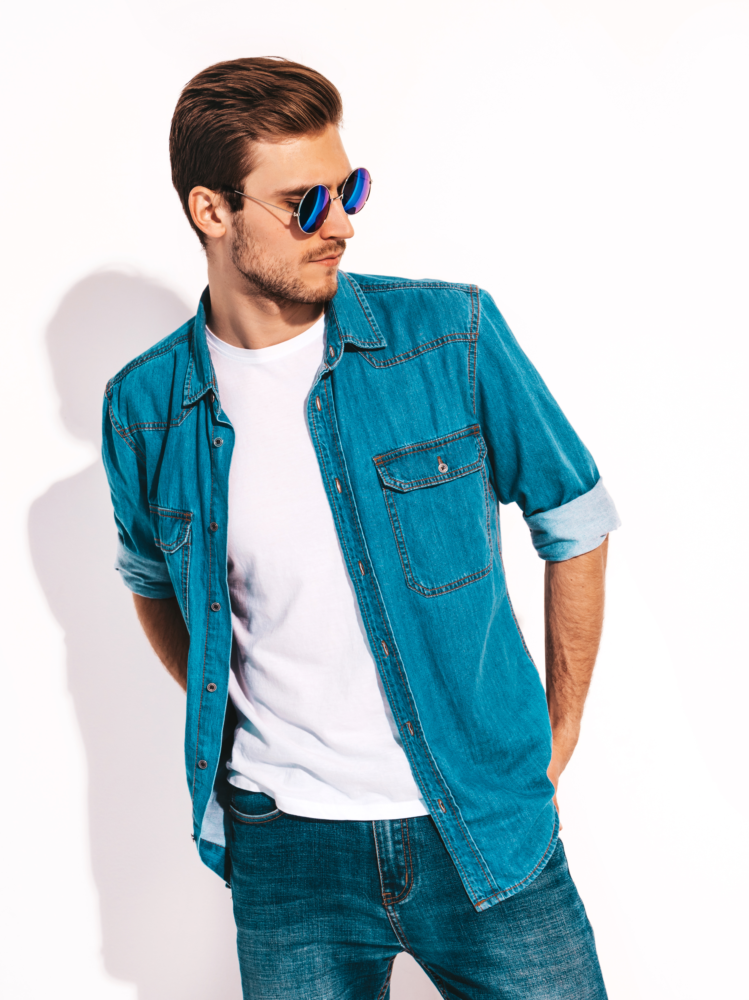

### Imagens geradas

Imagem em cinza:

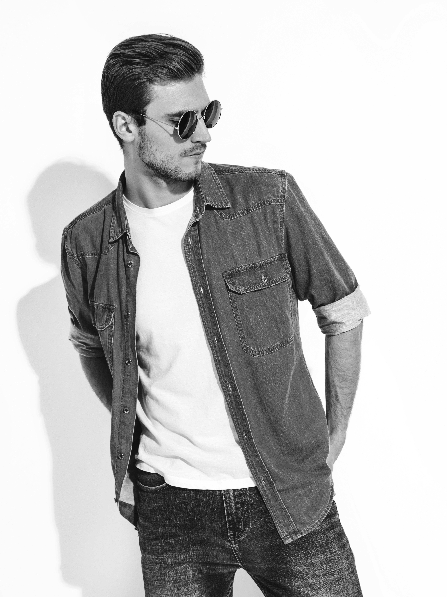

Imagem desfocada por filtro gaussiano:


Resultado final do esboco:

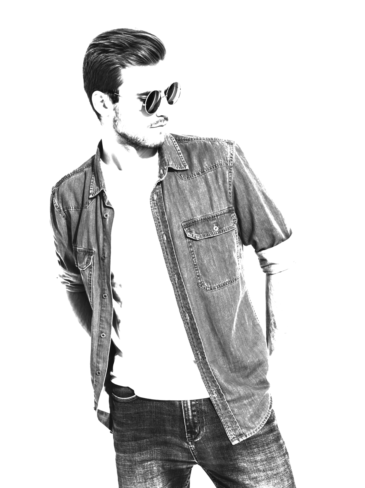

### Codigo implementado ate antes da plotagem

```python

img_q1_path = ROOT / "portrait-handsome-smiling-stylish-young-man-model-wearing-jeans-clothes-sunglasses-fashion-man.jpg"
img_q1 = cv2.imread(str(img_q1_path))
if img_q1 is None:
    raise FileNotFoundError(f"Nao foi possivel carregar a imagem da questao 1: {img_q1_path}")

def converter_para_cinza(img_colorida):
    b = img_colorida[:, :, 0].astype(np.float64)
    g = img_colorida[:, :, 1].astype(np.float64)
    r = img_colorida[:, :, 2].astype(np.float64)
    cinza = 0.299 * r + 0.587 * g + 0.114 * b
    return np.clip(cinza, 0, 255).astype(np.uint8)


def criar_kernel_gaussiano(tamanho, sigma=0):
    if sigma == 0:
        sigma = 0.3 * ((tamanho - 1) * 0.5 - 1) + 0.8
    ax = np.arange(-tamanho // 2 + 1.0, tamanho // 2 + 1.0)
    xx, yy = np.meshgrid(ax, ax)
    kernel = np.exp(-(xx ** 2 + yy ** 2) / (2.0 * sigma ** 2))
    return kernel / np.sum(kernel)


def aplicar_gaussiana(img, kernel):
    k_size = kernel.shape[0]
    pad = k_size // 2
    img_pad = np.pad(img.astype(np.float64), pad, mode='edge')
    h, w = img.shape
    resultado = np.zeros_like(img, dtype=np.float64)
    for i in range(h):
        for j in range(w):
            regiao = img_pad[i:i + k_size, j:j + k_size]
            resultado[i, j] = np.sum(regiao * kernel)
    return np.clip(resultado, 0, 255).astype(np.uint8)


def divisor_dodge(cinza, desfocada, escala=255.0):
    cinza_f = cinza.astype(np.float64)
    desfocada_f = desfocada.astype(np.float64)
    denominador = 255.0 - desfocada_f
    denominador = np.where(denominador == 0, 1e-10, denominador)
    esboco = (cinza_f / denominador) * escala
    return np.clip(esboco, 0, 255).astype(np.uint8)

cinza_q1 = converter_para_cinza(img_q1)
kernel_q1 = criar_kernel_gaussiano(21)
desfocada_q1 = aplicar_gaussiana(cinza_q1, kernel_q1)
esboco_q1 = divisor_dodge(cinza_q1, desfocada_q1)

cv2.imwrite(str(OUT_Q1 / "resultado_cinza.jpg"), cinza_q1)
cv2.imwrite(str(OUT_Q1 / "resultado_desfocada.jpg"), desfocada_q1)
cv2.imwrite(str(OUT_Q1 / "resultado_esboco.jpg"), esboco_q1)
```

### Análise e Insights

O efeito de esboço a lápis combina conversão para escala de cinza com desfoque gaussiano seguido de divisão dodge. Este processo realça as bordas e contornos da imagem original, produzindo um resultado visual semelhante a um desenho manual. O kernel gaussiano 21x21 suaviza principalmente os detalhes internos, enquanto a operação dodge compara diferenças de intensidade entre a versão original e desfocada. O resultado é uma imagem que apresenta baixo nível de detalhe em regiões uniformes e alto contraste nas transições, destacando contornos de roupas, expressões faciais e texturas relevantes no contexto de moda.

## Questao 2 - Correcao Gama

Nesta questao, a imagem monocromatica foi normalizada para o intervalo [0, 1], transformada por potencia com fator 1/gamma e reconvertida para [0, 255]. O experimento foi repetido para diferentes valores de gamma com o objetivo de comparar os efeitos de clareamento e escurecimento da imagem.

### Imagem usada

Imagem de entrada monocromatica:

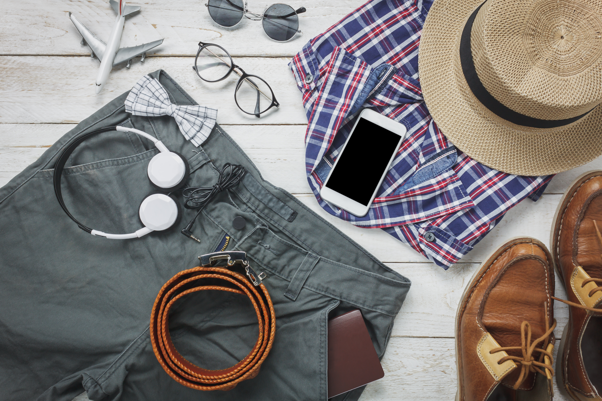

### Imagens geradas

Gamma 0.25:

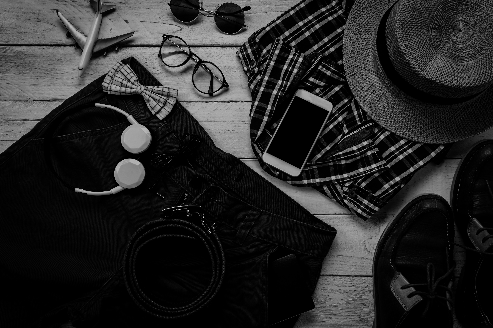

Gamma 0.5:

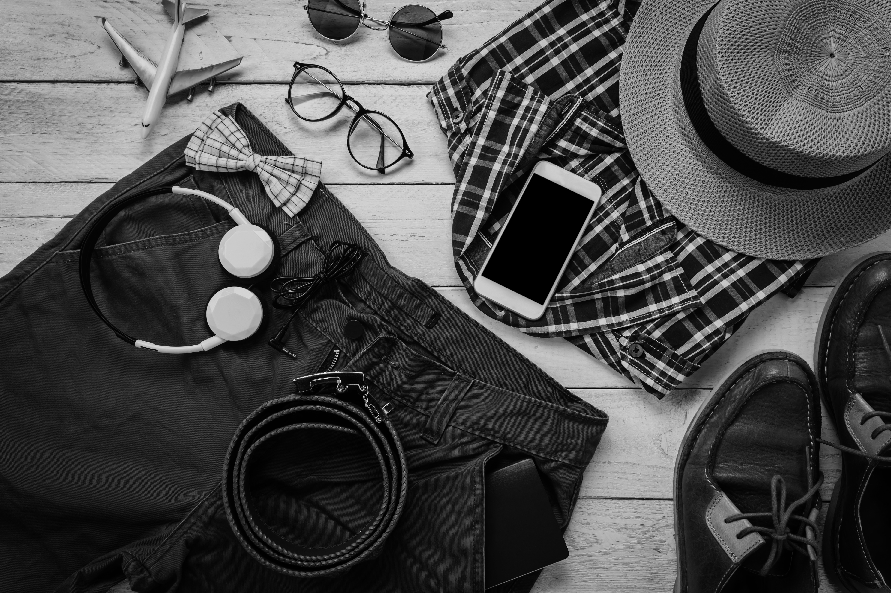

Gamma 1.0:

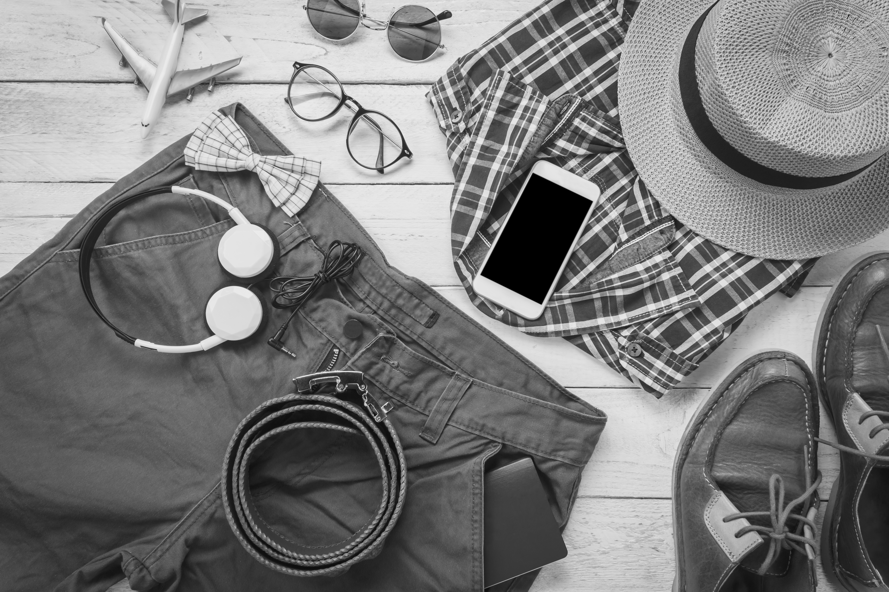

Gamma 1.5:


Gamma 2.0:


Gamma 3.0:


Comparativo salvo:

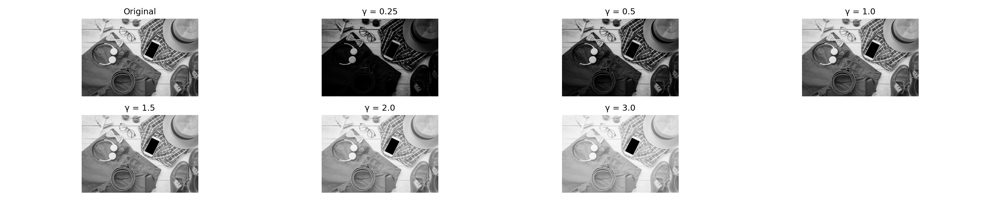

### Codigo implementado ate antes da plotagem

```python
img_q2_path = ROOT / "imagem2.jpg"
img_q2 = cv2.imread(str(img_q2_path), cv2.IMREAD_GRAYSCALE)
if img_q2 is None:
    raise FileNotFoundError(f"Nao foi possivel carregar a imagem da questao 2: {img_q2_path}")


def correcao_gama(img, gamma):
    img_normalizada = img.astype(np.float64) / 255.0
    img_corrigida = np.power(img_normalizada, 1.0 / gamma)
    return np.clip(img_corrigida * 255.0, 0, 255).astype(np.uint8)


gammas_q2 = [0.25, 0.5, 1.0, 1.5, 2.0, 3.0]
resultados_q2 = {}
for gamma in gammas_q2:
    resultado = correcao_gama(img_q2, gamma)
    resultados_q2[gamma] = resultado
    cv2.imwrite(str(OUT_Q2 / f"imagem2_gama_{gamma}.jpg"), resultado)
```

### Análise e Insights

A correção gama demonstra como a aplicação de transformações não-lineares no espaço de intensidades altera dramaticamente a percepção visual de uma imagem. Para valores de gamma menores que 1.0 (0.25, 0.5), a imagem é clarificada, expandindo os valores de pixel na faixa superior; para valores maiores que 1.0 (1.5, 2.0, 3.0), a imagem é escurecida, comprimindo os valores para a faixa inferior. O valor gamma = 1.0 preserva a imagem original. Este mecanismo é fundamental em processamento de imagens para compensar características de dispositivos de captura e exibição, sendo especialmente útil em fotografia e design quando imagens capturadas em condições de iluminação inadequada precisam ser corrigidas.

## Questao 3 - Media Ponderada em Niveis de Cinza

Nesta parte, duas imagens de mesmo tamanho foram convertidas para cinza e combinadas por media ponderada. Foram testadas tres combinacoes de pesos para verificar como a contribuicao relativa de cada imagem altera o resultado final. 

### Imagens usadas

Primeira imagem de entrada:


Segunda imagem de entrada:


### Imagens geradas

Combinacao 0.2 e 0.8:

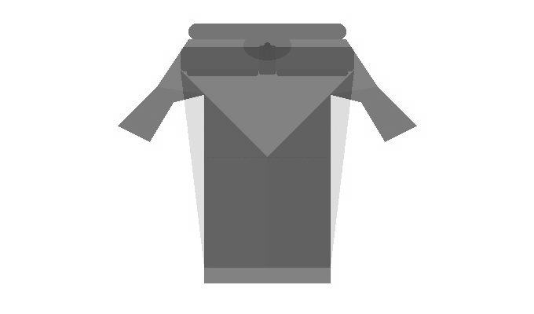

Combinacao 0.5 e 0.5:

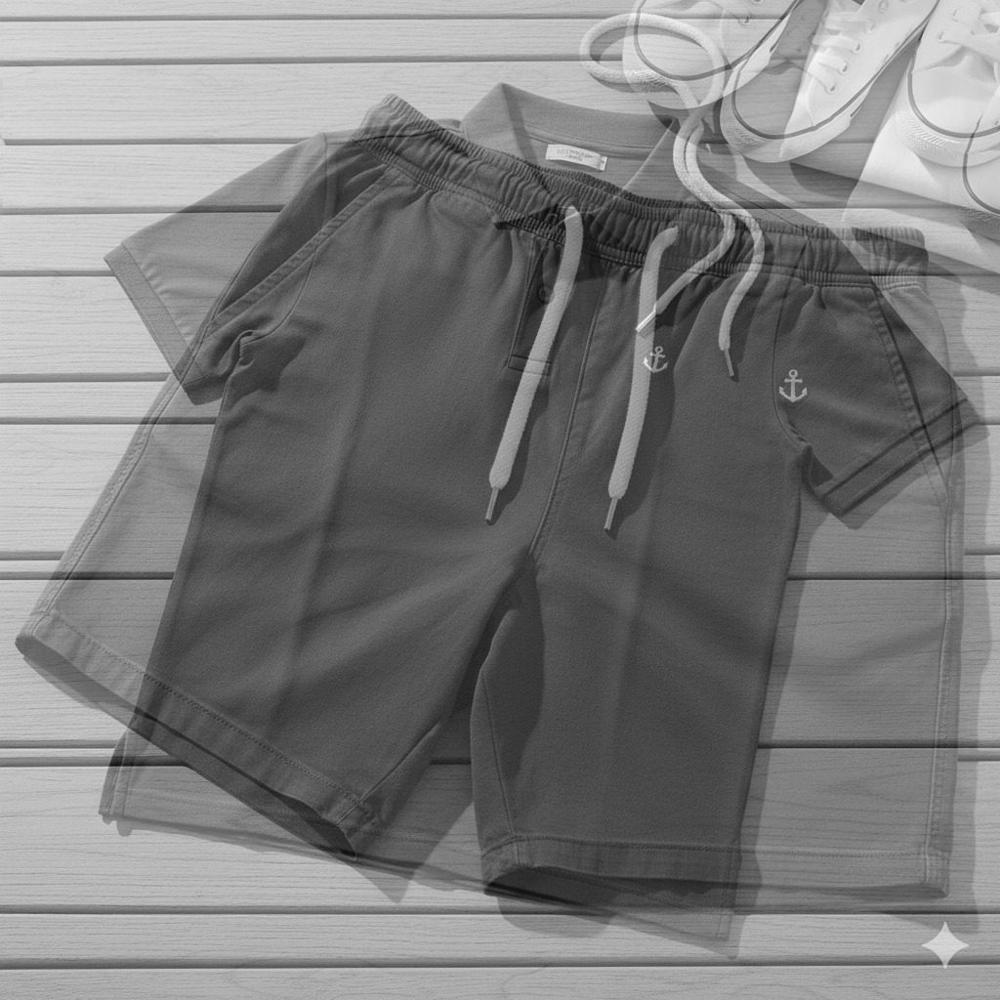

Combinacao 0.8 e 0.2:

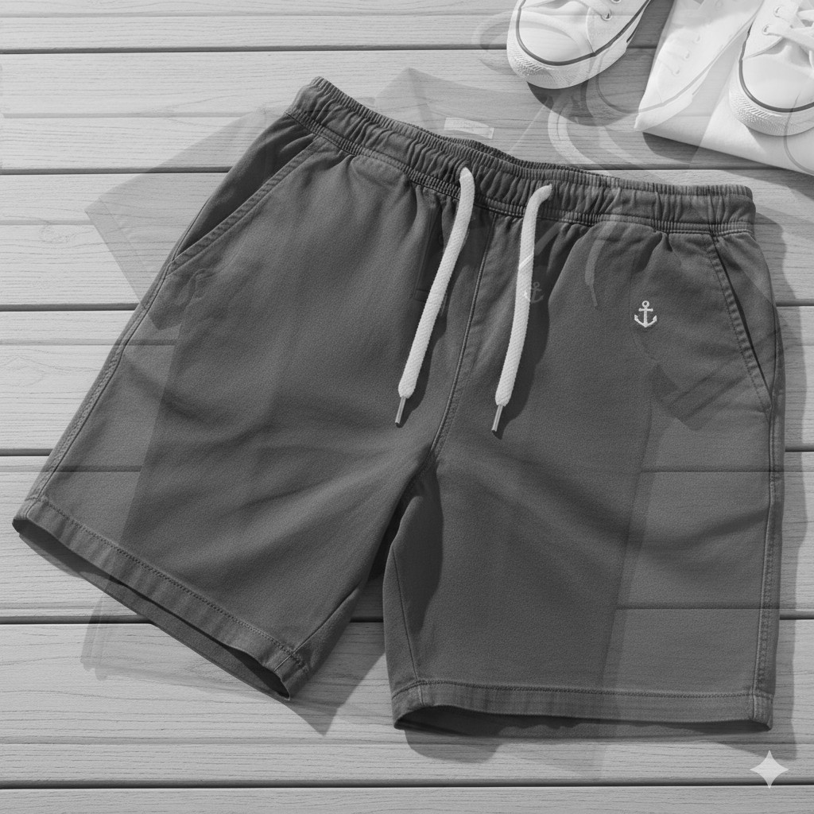

### Codigo implementado ate antes da plotagem

```python
# Questao 3 - implementacao completa
pasta_q3 = ROOT.parent / "imagens questao 3"
img_q3_1_path = pasta_q3 / "bermuda2.png"
img_q3_2_path = pasta_q3 / "blusa2.png"
img_q3_1 = cv2.imread(str(img_q3_1_path))
img_q3_2 = cv2.imread(str(img_q3_2_path))

if img_q3_1 is None or img_q3_2 is None:
    raise FileNotFoundError("Nao foi possivel carregar uma ou ambas as imagens da questao 3")
if img_q3_1.shape[:2] != img_q3_2.shape[:2]:
    raise ValueError(f"As imagens da questao 3 precisam ter o mesmo tamanho. Recebido: {img_q3_1.shape[:2]} e {img_q3_2.shape[:2]}")


def transformacao_cinza(img):
    if img.ndim == 2:
        return img.astype(np.float32)
    b = img[:, :, 0].astype(np.float32)
    g = img[:, :, 1].astype(np.float32)
    r = img[:, :, 2].astype(np.float32)
    return 0.114 * b + 0.587 * g + 0.299 * r


def media_ponderada(gray1, gray2, w1, w2):
    combinado = w1 * gray1 + w2 * gray2
    return np.clip(combinado, 0, 255).astype(np.uint8)


def resumo_metricas(img):
    return {
        "min": int(img.min()),
        "max": int(img.max()),
        "mean": float(np.mean(img)),
        "std": float(np.std(img)),
    }


gray_q3_1 = transformacao_cinza(img_q3_1)
gray_q3_2 = transformacao_cinza(img_q3_2)
comb_q3 = [
    (0.2, 0.8, "resultado_0.2_0.8.png"),
    (0.5, 0.5, "resultado_0.5_0.5.png"),
    (0.8, 0.2, "resultado_0.8_0.2.png"),
]
resultados_q3 = []
metricas_q3 = {}
for w1, w2, nome_saida in comb_q3:
    saida = media_ponderada(gray_q3_1, gray_q3_2, w1, w2)
    resultados_q3.append((w1, w2, nome_saida, saida))
    metricas_q3[nome_saida] = resumo_metricas(saida)
    cv2.imwrite(str(OUT_Q3 / nome_saida), saida)
```

### Análise e Insights

A combinação ponderada de duas imagens permite transições suaves e controle fino sobre a contribuição relativa de cada fonte. Quando w1 = 0.2 e w2 = 0.8, a imagem resultante apresenta características predominantemente da segunda imagem, funcionando como uma fusão que preserva detalhes de ambas. A proporção 0.5:0.5 distribui igualmente a influência, criando uma composição balanceada. Este tipo de operação é essencial em técnicas de blending e composição fotográfica, permitindo criar transições artísticas ou corrigir exposições diferenciadas quando múltiplas capturas são necessárias. No contexto de moda, isso facilita criação de efeitos visuais e comparação de sobreposições de peças.

## Questao 4 - Transformacoes no Espaco de Intensidades

Nesta questao foram aplicadas cinco transformacoes sobre uma imagem em tons de cinza: negativo, remapeamento de faixa para [100, 200], inversao horizontal das linhas pares, espelhamento da metade superior na metade inferior e espelhamento vertical completo. Cada resultado foi salvo individualmente e acompanhado por metricas basicas.

### Imagem usada

Imagem de entrada monocromatica:


### Imagens geradas

Negativo:

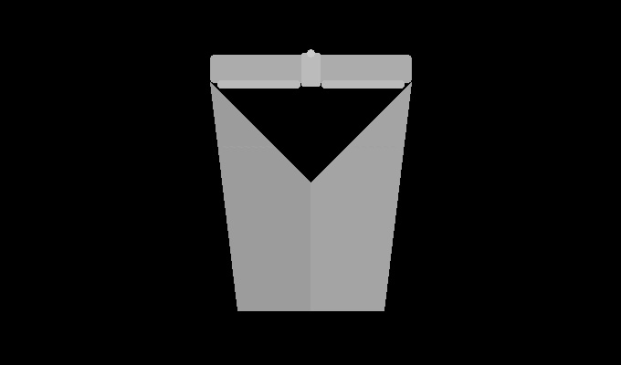

Remapeamento [100, 200]:

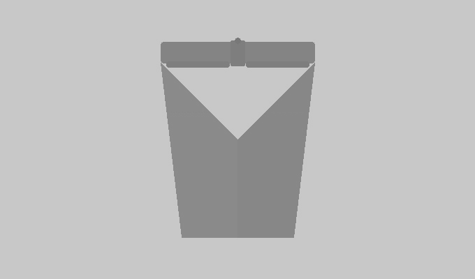

Linhas pares invertidas:

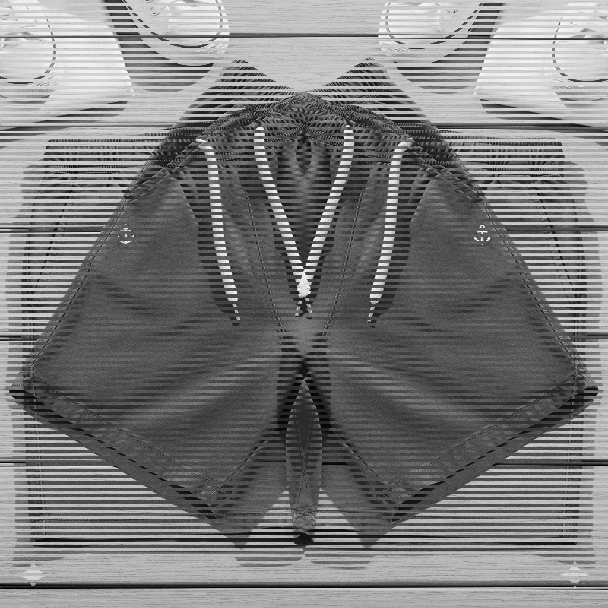

Espelhamento da metade superior:

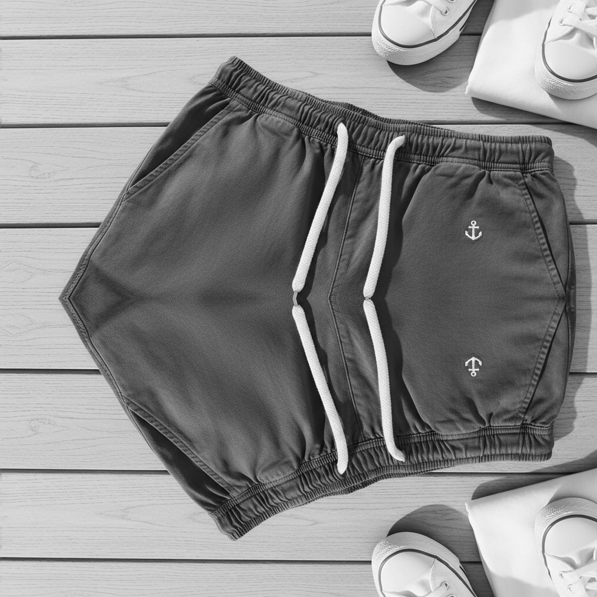

Espelhamento vertical:

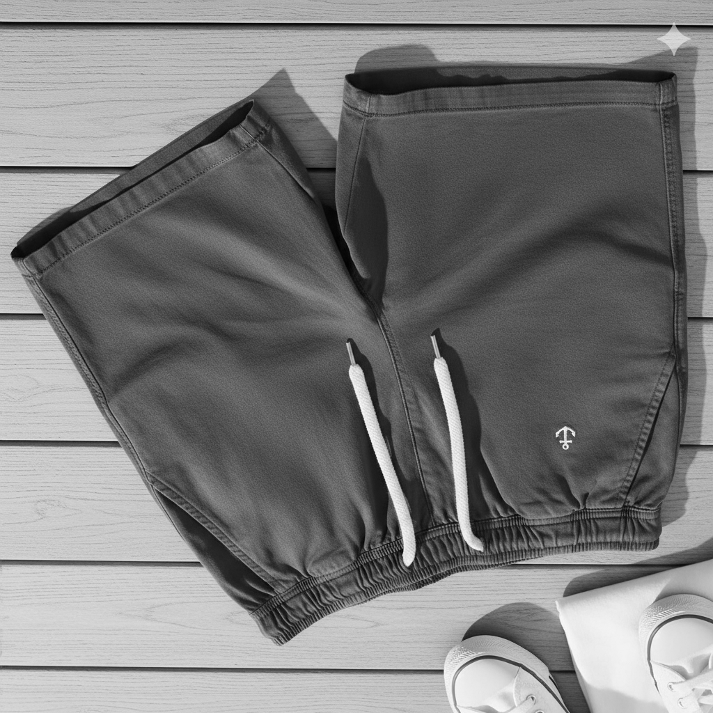

### Codigo implementado ate antes da plotagem

```python
pasta_q4 = ROOT / "imagens questao 4 "
img_q4_path = pasta_q4 / "bermuda2.png"
img_q4 = cv2.imread(str(img_q4_path), cv2.IMREAD_GRAYSCALE)
if img_q4 is None:
    raise FileNotFoundError(f"Nao foi possivel carregar a imagem da questao 4: {img_q4_path}")


def negativo(img):
    return (255 - img).astype(np.uint8)


def remapear_100_200(img):
    img_float = img.astype(np.float32)
    remapeado = 100.0 + (img_float * (100.0 / 255.0))
    return np.clip(remapeado, 100, 200).astype(np.uint8)


def inverter_linhas_pares(img):
    resultado = img.copy()
    resultado[0::2, :] = resultado[0::2, ::-1]
    return resultado


def espelhar_metade_superior_na_inferior(img):
    resultado = img.copy()
    altura = resultado.shape[0]
    metade = altura // 2
    metade_superior = resultado[:metade, :].copy()

    if altura % 2 == 0:
        resultado[metade:, :] = metade_superior[::-1]
    else:
        resultado[metade + 1 :, :] = metade_superior[::-1]

    return resultado


def espelhamento_vertical(img):
    return img[::-1, :].copy()


def metricas_basicas(img):
    return {
        "min": int(img.min()),
        "max": int(img.max()),
        "mean": float(np.mean(img)),
        "std": float(np.std(img)),
    }


negativo_q4 = negativo(img_q4)
remapeado_q4 = remapear_100_200(img_q4)
pares_invertidos_q4 = inverter_linhas_pares(img_q4)
espelhado_q4 = espelhar_metade_superior_na_inferior(img_q4)
vertical_q4 = espelhamento_vertical(img_q4)

transformacoes_q4 = [
    ("negativo", "01_bermuda_negativo.png", negativo_q4),
    ("remapeado_100_200", "02_bermuda_remapeado_100_200.png", remapeado_q4),
    ("linhas_pares_invertidas", "03_bermuda_linhas_pares_invertidas.png", pares_invertidos_q4),
    ("espelhado_metade_superior", "04_bermuda_espelhado_metade_superior.png", espelhado_q4),
    ("espelhamento_vertical", "05_bermuda_espelhamento_vertical.png", vertical_q4),
]

metricas_q4 = {}
for nome, arquivo, imagem in transformacoes_q4:
    caminho_saida = OUT_Q4 / arquivo
    ok = cv2.imwrite(str(caminho_saida), imagem)
    if not ok:
        raise IOError(f"Falha ao salvar: {caminho_saida}")
    metricas_q4[arquivo] = metricas_basicas(imagem)
```

### Análise e Insights

As transformações de espaço de intensidades demonstram manipulações fundamentais em processamento de imagens. O negativo inverte a percepção visual completa, útil para revelar detalhes em regiões de sombra. O remapeamento para [100, 200] redimensiona a faixa dinâmica, comprimindo o contraste e criando uma versão mais suave. Inversões de linhas pares e espelhamentos executam operações espaciais que preservam informação mas alteram layout, úteis para correções de captura ou criação de efeitos artísticos. O espelhamento vertical completo, mais simples, cria simetria e pode ser usado para análise de composição fotográfica. Conjuntamente, essas operações exemplificam como o mesmo pixel pode ser manipulado de diversas formas para obter efeitos visuais distintos sem perda de dados.

## Questao 5 - Mosaico 4 x 4

Aqui a imagem foi recortada para dimensoes multiplas de 4 e dividida em 16 blocos iguais. Depois disso, os blocos foram rearranjados conforme a ordem definida no enunciado para formar o mosaico final 4x4. O processo gera tanto o recorte base quanto o mosaico reconstruido.

### Imagem usada

Imagem de entrada monocromatica:


### Imagens geradas

Recorte base:


Mosaico 4x4:

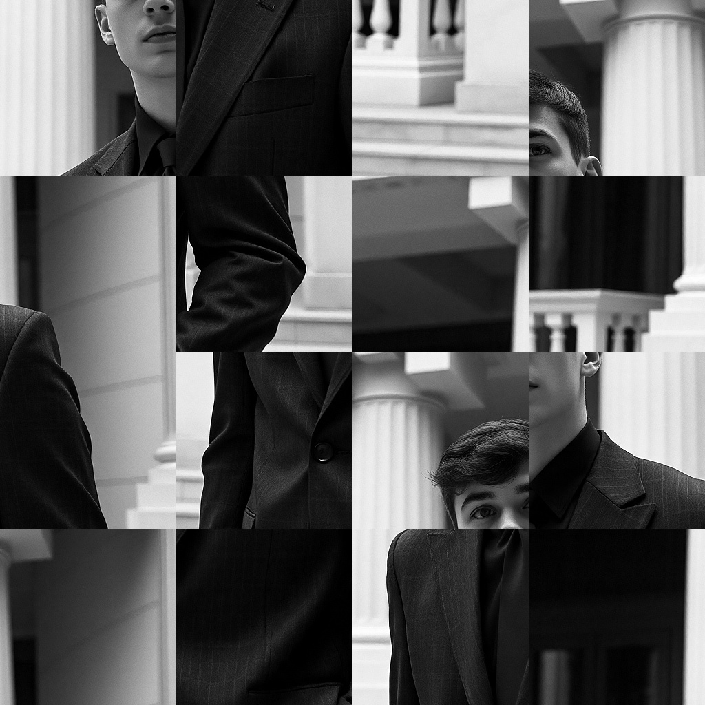

Comparativo salvo:

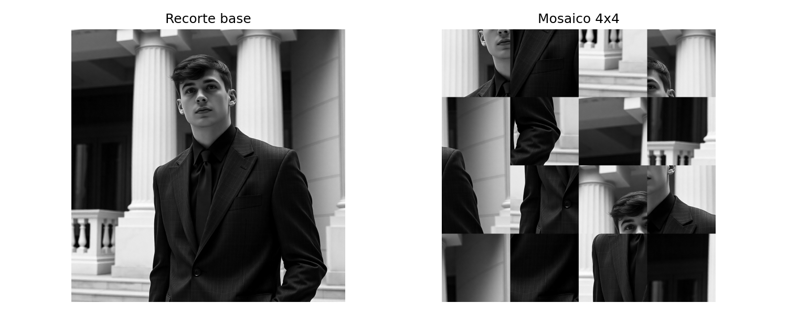

### Codigo implementado ate antes da plotagem

```python
img_q5_path = ROOT / "imagens questao 5" / "image.png"
img_q5 = cv2.imread(str(img_q5_path), cv2.IMREAD_GRAYSCALE)
if img_q5 is None:
    raise FileNotFoundError(f"Nao foi possivel carregar a imagem da questao 5: {img_q5_path}")


def construir_blocos_4x4(img):
    h, w = img.shape
    h4 = (h // 4) * 4
    w4 = (w // 4) * 4
    recorte = img[:h4, :w4]
    bh = h4 // 4
    bw = w4 // 4

    blocos = []
    for i in range(4):
        for j in range(4):
            bloco = recorte[i * bh : (i + 1) * bh, j * bw : (j + 1) * bw].copy()
            blocos.append(bloco)

    return recorte, blocos, bh, bw


def montar_mosaico_por_ordem(blocos, ordem):
    linhas = []
    for linha_ordem in ordem:
        linha_blocos = [blocos[indice - 1] for indice in linha_ordem]
        linhas.append(np.hstack(linha_blocos))
    return np.vstack(linhas)


ordem_q5 = [
    [6, 11, 13, 3],
    [8, 16, 1, 9],
    [12, 14, 2, 7],
    [4, 15, 10, 5],
]

recorte_q5, blocos_q5, bloco_h_q5, bloco_w_q5 = construir_blocos_4x4(img_q5)
mosaico_q5 = montar_mosaico_por_ordem(blocos_q5, ordem_q5)

ok_recorte = cv2.imwrite(str(OUT_Q5 / "01_q5_recorte_base.png"), recorte_q5)
ok_mosaico = cv2.imwrite(str(OUT_Q5 / "02_q5_mosaico_4x4.png"), mosaico_q5)
if not ok_recorte or not ok_mosaico:
    raise IOError("Falha ao salvar resultados da questao 5")
```

### Análise e Insights

A reorganização de blocos em mosaico preserva toda a informação original da imagem mas reordena sua disposição espacial conforme padrão predefinido. Este procedimento demonstra princípios de indexação e rearranjo de dados, frequentemente usado em processamento de imagens para criar efeitos visuais, testes de resistência de algoritmos ou extração de padrões. A manutenção dimensional (mesma resolução antes e depois) indica que nenhuma informação é descartada, apenas rearranjada. Visualmente, o resultado pode parecer caótico dependendo da ordem definida, ilustrando como a disposição espacial dos elementos influencia a interpretação visual mesmo quando o conteúdo pixel-a-pixel permanece constante.

## Questao 6 - Quantizacao em Diferentes Niveis

Nesta etapa, a imagem foi quantizada em diferentes numeros de niveis de cinza, de 256 ate 2 niveis. A implementacao calcula um fator de quantizacao e mapeia cada pixel para o nivel discreto correspondente. Assim, foi possivel observar a perda progressiva de detalhes conforme o numero de niveis diminui.

### Imagem usada

Imagem de entrada monocromatica:


### Imagens geradas

256 niveis:

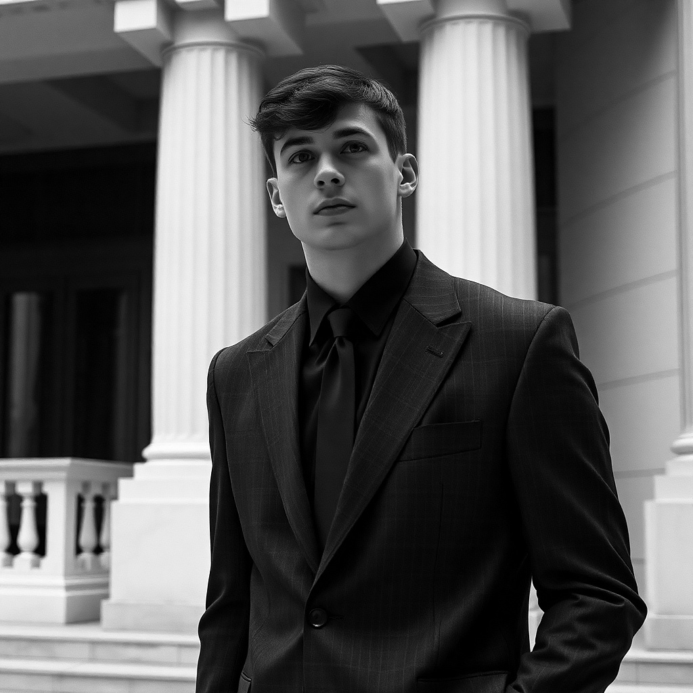

64 niveis:


32 niveis:


16 niveis:


8 niveis:

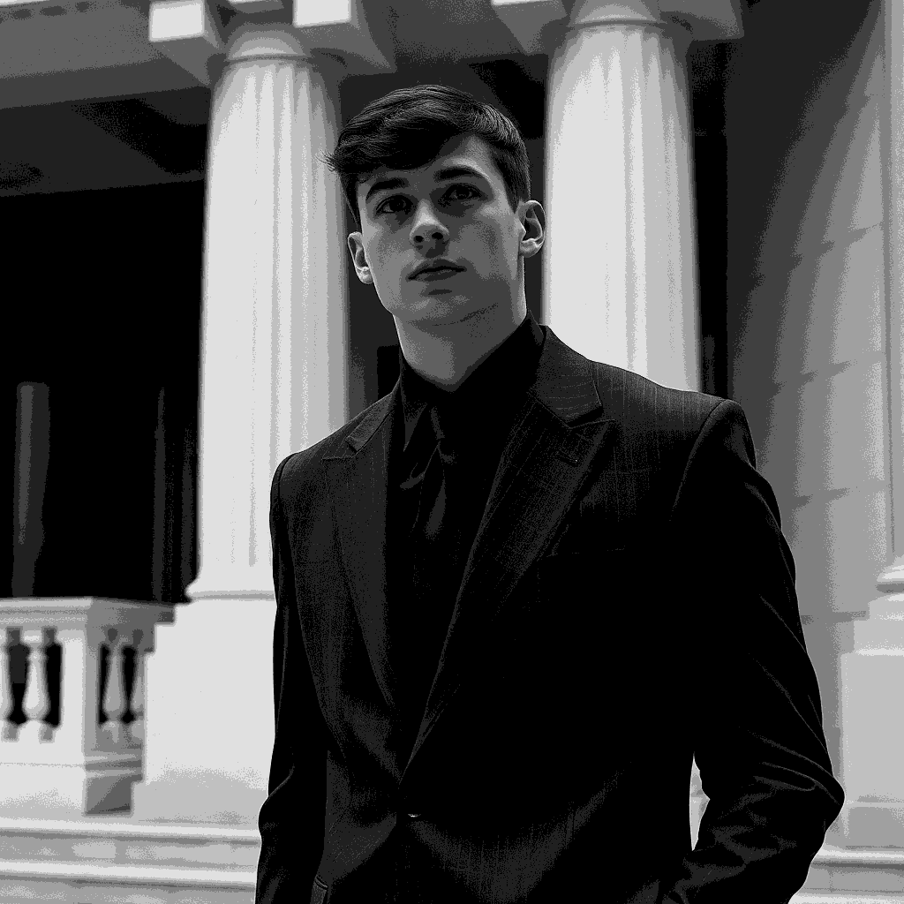

4 niveis:


2 niveis:

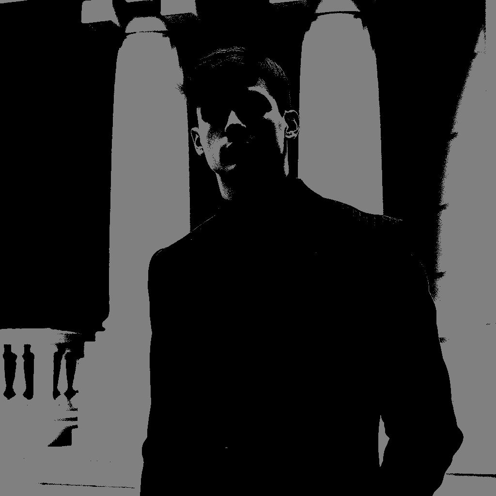

Comparativo salvo:


### Codigo implementado ate antes da plotagem

```python
img_q6_path = ROOT / "imagens questao 6" / "image.png"
img_q6 = cv2.imread(str(img_q6_path), cv2.IMREAD_GRAYSCALE)
if img_q6 is None:
    raise FileNotFoundError(f"Nao foi possivel carregar a imagem da questao 6: {img_q6_path}")


def quantizar_niveis(img, niveis):
    if niveis == 256:
        return img.copy()

    fator = 256 // niveis
    img_float = img.astype(np.float32)
    quant = np.floor(img_float / fator) * fator
    return np.clip(quant, 0, 255).astype(np.uint8)


niveis_q6 = [256, 64, 32, 16, 8, 4, 2]
resultados_q6 = {}

for nivel in niveis_q6:
    q_img = quantizar_niveis(img_q6, nivel)
    resultados_q6[nivel] = q_img
    ok = cv2.imwrite(str(OUT_Q6 / f"q6_{nivel}_niveis.png"), q_img)
    if not ok:
        raise IOError(f"Falha ao salvar quantizacao de {nivel} niveis")
```

### Análise e Insights

A quantização reduz a profundidade de cor de uma imagem, passando de 256 niveis para quantidades progressivamente menores. Com 256 niveis, a imagem original é preservada; em 64 niveis, a redução é imperceptível exceto por possível posterização suave; em 32 e 16 niveis, o efeito posterizado torna-se evidente com bandas de cor distintas. Em 8, 4 e especialmente 2 niveis, a perda de detalhes é drástica, reduzindo a imagem a essencialmente silhuetas e altos contrastes. Este processo demonstra o conceito de profundidade de bits e sua relação com qualidade visual. Quantização é usado para compressão de imagem, criação de efeitos artísticos e simulação de limitações de dispositivos legacy. A progressão visual ilustra perfeitamente o trade-off entre tamanho de arquivo e fidelidade visual.

## Encerramento

As seis questoes foram implementadas manualmente conforme as regras da atividade, com leitura e gravacao de arquivos via OpenCV e processamento de pixels por funcoes proprias. O material acima organiza os resultados de forma direta e rastreavel, conectando procedimento, imagem de entrada, imagem gerada e trecho de codigo correspondente para cada etapa.
